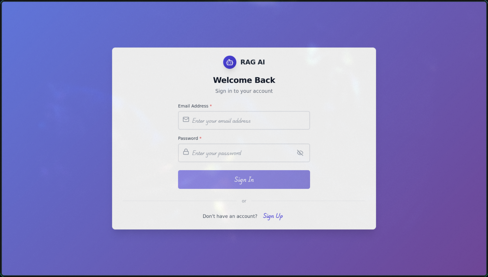
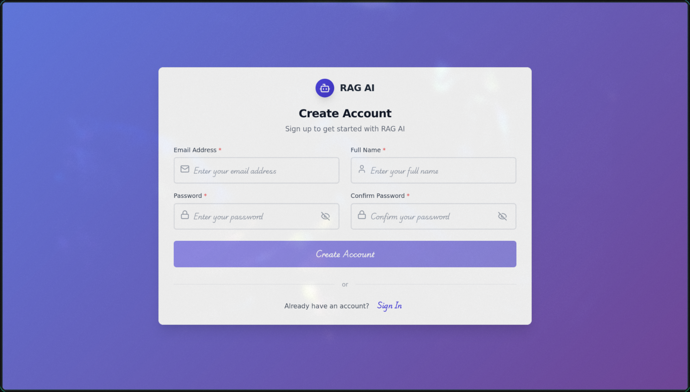
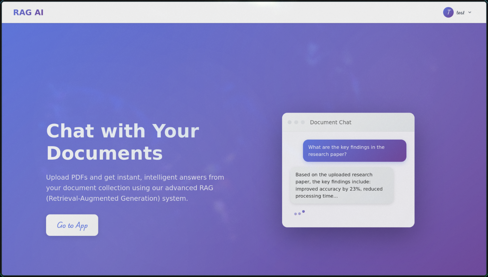
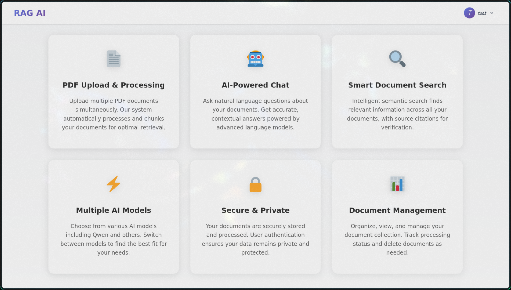
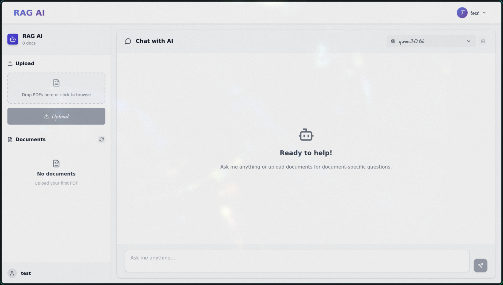
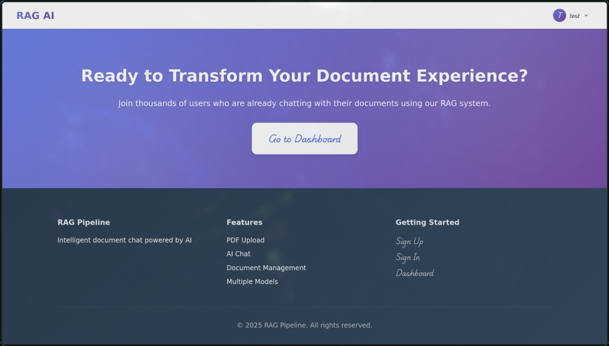

<!-- filepath: /home/vardhin/Documents/github/ragai/README.md -->
# 🤖 RAG AI - Intelligent Document Chat

A modern Retrieval-Augmented Generation (RAG) application that enables natural language conversations with your PDF documents. Built with SvelteKit, FastAPI, and Ollama for local AI inference.

## 📸 Screenshots

### Authentication Flow
| Sign In | Sign Up |
|---------|---------|
|  |  |

### Application Interface
| Home Dashboard | Document Upload |
|----------------|-----------------|
|  |  |

| Document Management | Chat Interface |
|--------------------|----------------|
|  |  |

| Document Processing |
|-------------------|
|  |

## 🎯 Aim

To develop an intelligent document interaction system that bridges the gap between static document storage and dynamic information retrieval, enabling users to engage in natural language conversations with their document collections for enhanced knowledge discovery and accessibility.

## 🎯 Objective

- **Democratize Document Access**: Make document content accessible through natural language queries, eliminating the need for manual searching and reading
- **Local AI Implementation**: Provide a privacy-focused solution using local AI models, ensuring data security and independence from cloud services
- **Seamless Integration**: Create an intuitive web interface that seamlessly integrates document upload, processing, and querying in a unified workflow
- **Scalable Architecture**: Build a modular system that can handle multiple document formats and scale with user requirements
- **Real-time Interaction**: Deliver immediate, contextually relevant responses with source attribution for transparency

## 📚 Background

Traditional document management systems suffer from several limitations:

- **Static Storage**: Documents are stored but not made truly accessible for dynamic querying
- **Search Limitations**: Keyword-based search often misses semantic context and relationships
- **Information Silos**: Knowledge remains locked within documents, requiring manual extraction
- **Privacy Concerns**: Cloud-based solutions raise data security and privacy issues
- **Technical Barriers**: Complex AI systems are often inaccessible to non-technical users

The emergence of Large Language Models (LLMs) and vector databases has created new opportunities for intelligent document interaction. However, most existing solutions rely on cloud services or require complex technical setup.

## 🧮 Theory

### Retrieval-Augmented Generation (RAG)

RAG combines the power of information retrieval with generative AI to create contextually aware responses:

```
Query → Vector Embedding → Similarity Search → Context Retrieval → LLM Generation → Response
```

**Key Components:**

1. **Document Chunking**: Large documents are split into semantic chunks to optimize retrieval and processing
2. **Vector Embeddings**: Text chunks are converted into high-dimensional vectors that capture semantic meaning
3. **Similarity Search**: User queries are matched against document vectors using cosine similarity
4. **Context Augmentation**: Retrieved chunks provide context to the language model for informed responses
5. **Source Attribution**: Responses include references to original document sources for verification

### Vector Database Architecture

The system uses SQLite with vector extensions for efficient similarity search:

- **Embedding Storage**: Document chunks stored as vectors with metadata
- **Similarity Metrics**: Cosine similarity for semantic matching
- **Indexing**: Optimized indexing for fast retrieval across large document collections
- **User Isolation**: Vector spaces partitioned by user for privacy and security

### Language Model Integration

Local LLM integration through Ollama provides:

- **Privacy**: All processing happens locally, no data leaves the system
- **Customization**: Model selection based on performance and accuracy requirements
- **Streaming**: Real-time response generation for better user experience
- **Cost Efficiency**: No API costs or usage limitations

## 🌟 Features

- **📄 PDF Document Processing** - Upload and process PDF files with intelligent text extraction
- **🧠 Conversational AI** - Chat with your documents using local LLMs via Ollama
- **🔍 Semantic Search** - Vector-based similarity search for relevant content retrieval
- **🔐 User Authentication** - Secure JWT-based authentication system
- **⚡ Real-time Streaming** - Live response streaming for better user experience
- **📱 Responsive Design** - Works seamlessly across desktop, tablet, and mobile
- **🎯 Source Attribution** - Responses include references to source documents

## 🏗️ Architecture

```
┌─────────────────┐ ┌─────────────────┐ ┌─────────────────┐
│    Frontend     │ │     Backend     │ │   AI Models     │
│   (SvelteKit)   │◄──►│   (FastAPI)    │◄──►│   (Ollama)     │
└─────────────────┘ └─────────────────┘ └─────────────────┘
        │                   │                   │
        │                   │                   │
        ▼                   ▼                   ▼
┌─────────────────┐ ┌─────────────────┐ ┌─────────────────┐
│  Web Browser    │ │  Vector Store   │ │   Embeddings    │
│   Interface     │ │   (SQLite)      │ │    Engine       │
└─────────────────┘ └─────────────────┘ └─────────────────┘
```

## 📁 Project Structure

```
ragai/
├── frontend/              # SvelteKit frontend application
│   ├── src/
│   │   ├── routes/
│   │   │   ├── +page.svelte
│   │   │   ├── auth/
│   │   │   └── app/
│   │   ├── lib/
│   │   │   └── components/
│   │   └── app.html
│   └── package.json
├── backend/               # FastAPI backend application
│   ├── main.py           # FastAPI application entry
│   ├── auth.py           # Authentication system
│   ├── pdf_processor.py  # PDF processing logic
│   ├── embeddings.py     # Vector embeddings handling
│   ├── vector_store.py   # Vector database operations
│   ├── uploads/          # Document storage
│   ├── auth.db          # User authentication database
│   └── vector_store.db  # Vector embeddings database
└── README.md
```

## 🚀 Quick Start

### Prerequisites

- Python 3.8+
- Node.js 16+
- [Ollama](https://ollama.ai/) installed and running

### Installation

1. **Clone the repository**
   ```bash
   git clone https://github.com/yourusername/ragai.git
   cd ragai
   ```

2. **Install and start Ollama**
   ```bash
   # Install Ollama (if not already installed)
   curl -fsSL https://ollama.ai/install.sh | sh
   
   # Start Ollama service
   ollama serve
   
   # Pull required models
   ollama pull llama2
   ollama pull nomic-embed-text
   ```

3. **Backend Setup**
   ```bash
   cd backend
   pip install -r requirements.txt
   python main.py
   ```

4. **Frontend Setup**
   ```bash
   cd frontend
   npm install
   npm run dev
   ```

5. **Access the application**
   
   Open [http://localhost:5173](http://localhost:5173) in your browser

## 🔌 API Endpoints

### Authentication
- `POST /auth/register` - User registration
- `POST /auth/login` - User login
- `GET /auth/me` - Get user profile

### Document Management
- `POST /upload/` - Upload PDF documents
- `GET /documents/` - List user documents
- `DELETE /documents/{doc_id}` - Delete document

### Chat & Query
- `POST /query/stream/` - Stream RAG responses (with documents)
- `POST /chat/stream/` - Stream chat responses (without documents)
- `GET /models/` - List available AI models

## 🧠 How It Works

### Document Processing Pipeline

1. **Upload** - User uploads PDF files through the web interface
2. **Text Extraction** - Backend extracts text content using PyMuPDF
3. **Chunking** - Documents are split into semantic chunks
4. **Embedding** - Chunks are converted to vector embeddings
5. **Storage** - Vectors are stored in SQLite database with metadata

### Query Processing Pipeline

1. **User Input** - User asks a question in natural language
2. **Query Embedding** - Question is converted to vector representation
3. **Similarity Search** - Most relevant document chunks are retrieved
4. **Context Assembly** - Relevant chunks are prepared as context
5. **AI Generation** - Language model generates response using context
6. **Streaming Response** - Answer is streamed back to user with sources

## 🔒 Security Features

- **JWT Authentication** - Secure token-based authentication
- **User Isolation** - Documents are user-specific and isolated
- **Input Validation** - Comprehensive input sanitization
- **File Type Validation** - Only PDF uploads allowed
- **CORS Configuration** - Proper cross-origin request handling

## 🎨 UI/UX Features

- **Responsive Layout** - Adapts to mobile, tablet, and desktop
- **Real-time Feedback** - Loading states and progress indicators
- **Error Handling** - Graceful error messages and recovery
- **Accessibility** - Keyboard navigation and screen reader support
- **Performance** - Optimized for fast loading and smooth interactions

## 🛠️ Development

### Running in Development

```bash
# Backend
cd backend
uvicorn main:app --reload

# Frontend
cd frontend
npm run dev
```

### Building for Production

```bash
# Frontend
cd frontend
npm run build

# Backend (using gunicorn)
cd backend
gunicorn main:app -k uvicorn.workers.UvicornWorker
```

## 📊 Performance Considerations

- **Vector Search Optimization** - Efficient similarity search algorithms
- **Streaming Responses** - Non-blocking real-time response delivery
- **Caching** - Strategic caching of embeddings and responses
- **Lazy Loading** - Components loaded on demand
- **Memory Management** - Efficient handling of large documents

## 🤝 Contributing

1. Fork the repository
2. Create a feature branch (`git checkout -b feature/amazing-feature`)
3. Make your changes
4. Add tests if applicable
5. Commit your changes (`git commit -m 'Add amazing feature'`)
6. Push to the branch (`git push origin feature/amazing-feature`)
7. Submit a pull request

## 📄 License

This project is open source and available under the [MIT License](LICENSE).

## 🔮 Roadmap

- [ ] Support for additional document formats (DOCX, TXT, etc.)
- [ ] Advanced document preprocessing (OCR, table extraction)
- [ ] Multi-language support
- [ ] Advanced analytics and insights
- [ ] Team collaboration features
- [ ] API rate limiting and quotas
- [ ] Enhanced security features

## 🙋‍♂️ Support

If you have any questions or run into issues, please [open an issue](https://github.com/yourusername/ragai/issues) on GitHub.

---

**RAG AI** - Transforming document interaction through intelligent conversation. Upload, ask, and discover insights from your documents like never before.